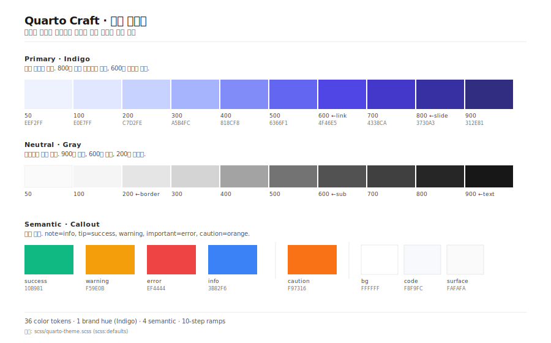
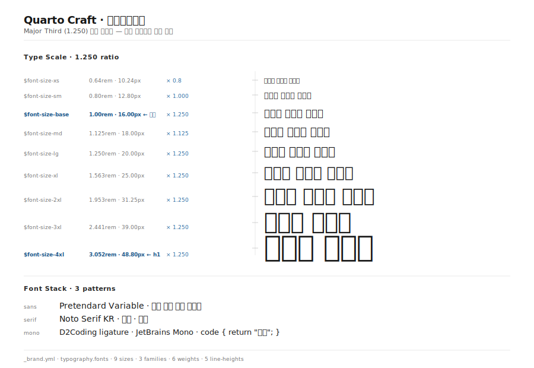
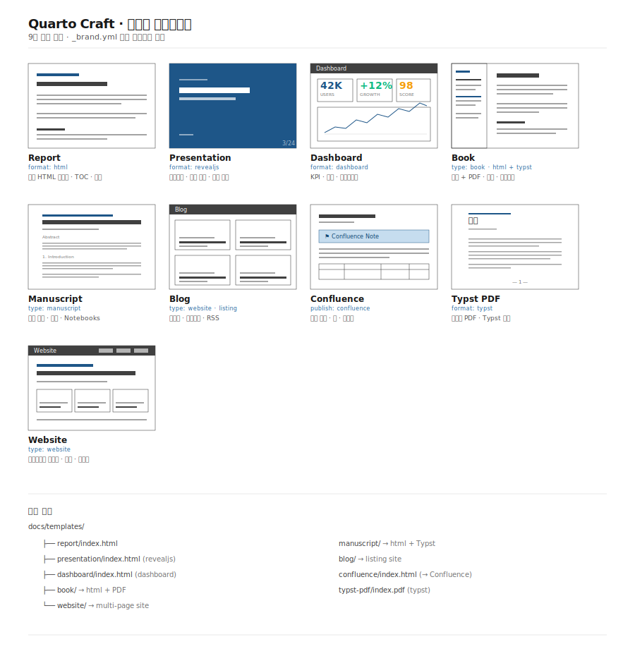

## Quarto Craft란?

**Quarto Craft**는 한국어 문서에 최적화된 Quarto 디자인 시스템입니다.

### 주요 특징

- **Pretendard Variable** 가변 폰트로 한글 렌더링 최적화
- `word-break: keep-all`로 단어 단위 줄바꿈
- `line-height: 1.75` — 한국어에 적합한 넓은 행간
- 9종 템플릿: 리포트 · 프레젠테이션 · 대시보드 · 책 · 원고 · 블로그 · 웹사이트 · Confluence · Typst PDF

### 타입 스케일

Major Third(1.250)를 기반으로 한 8단계 폰트 스케일로 시각적 위계를 명확하게 표현합니다.



### 9종 템플릿 생태계

같은 `_brand.yml` 토큰을 공유하므로 HTML · RevealJS · Typst PDF가 색상·폰트·간격에서 완전히 일관됩니다.



### 코드 예시

```r
library(ggplot2)

ggplot(mtcars, aes(wt, mpg)) +
  geom_point(color = "#4080B7") +  # quarto-blue-600
  theme_minimal()
```

## 시작하기

```bash
quarto render templates/report/index.qmd
```
