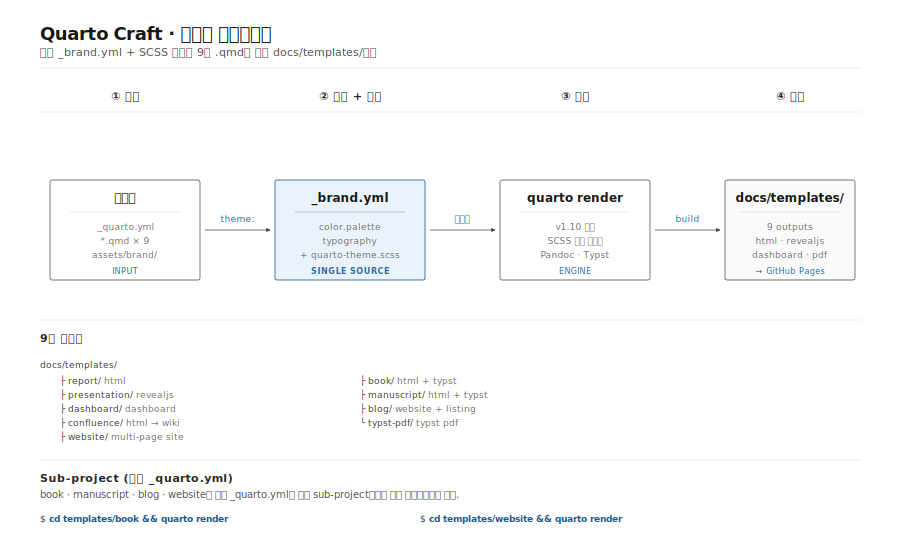
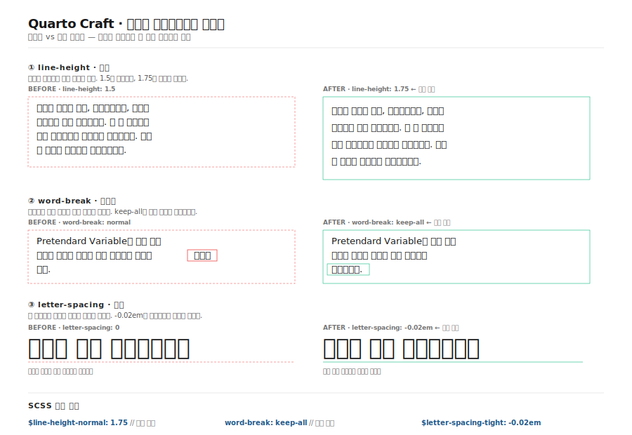

## Quarto 1.9의 새 기능

Quarto 1.9부터 **Typst** 기반의 멀티 챕터 PDF 북을 공식 지원합니다.

### LaTeX 대비 Typst의 장점

| 항목 | LaTeX | Typst |
|------|-------|-------|
| 컴파일 속도 | 느림 | 매우 빠름 |
| 한국어 지원 | 패키지 필요 | 기본 지원 |
| 문법 | 복잡 | 간결 |

### 한국어 조판 최적화

Quarto Craft는 Typst 출력에서도 한국어 가독성 규칙을 적용합니다 — `linestretch: 1.5` 행간,
Pretendard 폰트, D2Coding ligature 코드 폰트.



### 설정 예시

```yaml
format:
  typst:
    lang: ko
    mainfont: "Pretendard"
    toc: true
```

HTML 웹북과 Typst PDF를 동시에 생성하려면 `downloads: [pdf]`를
`_quarto.yml`에 추가하면 됩니다.
